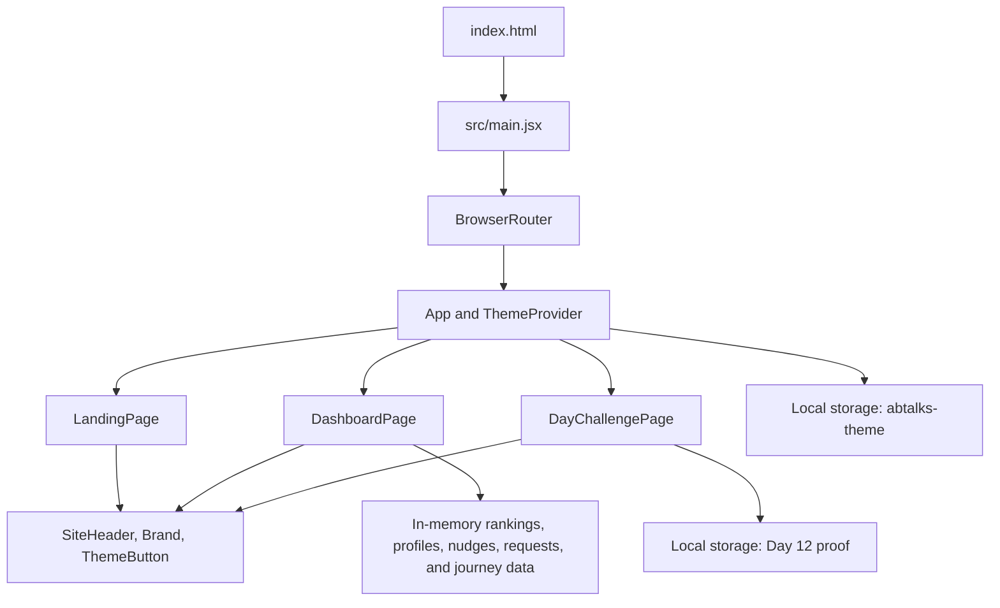

# ABTalks 60-Day Coding Challenge

## Project Links

| Resource | Link |
| --- | --- |
| Prompt history | [View `prompt.md`](./prompt/prompt.md) |
| Vercel live site | [team-vajra-abtalk-site.vercel.app](https://team-vajra-abtalk-site.vercel.app/) |
| GitHub repository | [Shivam-r-kumar/team-vajra-abtalk-site](https://github.com/Shivam-r-kumar/team-vajra-abtalk-site) |

## Table of Contents

1. [Project Overview](#project-overview)
2. [Core Product Experience](#core-product-experience)
3. [Application Routes](#application-routes)
4. [Feature Guide](#feature-guide)
5. [Technology Stack](#technology-stack)
6. [Architecture and Data Flow](#architecture-and-data-flow)
7. [Project Structure](#project-structure)
8. [Getting Started from Scratch](#getting-started-from-scratch)
9. [Available Commands](#available-commands)
10. [Theme System](#theme-system)
11. [Local Data and Persistence](#local-data-and-persistence)
12. [Responsive Design](#responsive-design)
13. [Accessibility](#accessibility)
14. [Assets and Metadata](#assets-and-metadata)
15. [Vercel Deployment](#vercel-deployment)
16. [Environment Variables and APIs](#environment-variables-and-apis)
17. [Current Demo Limitations](#current-demo-limitations)
18. [Development Guide](#development-guide)

## Project Overview

This project is a responsive React single-page application for the ABTalks 60-Day Coding Challenge. It is designed for students and early-career developers who want to build consistently, publish proof of work, follow their progress, and stay connected with a learning community.

The application combines three connected experiences:

- A public landing page that explains the challenge and the ABTalks community.
- A student dashboard that presents the current challenge, progress, achievements, ranking, friends, and submission history.
- A Day 12 challenge page where a student can review the brief, inspect a reference design, and save GitHub and LinkedIn proof of work.

The current version is a polished front-end demonstration. It does not require authentication or a backend. Theme and Day 12 submission data are stored locally in the browser.

## Core Product Experience

The product is built around a simple daily loop:

1. Open the dashboard and review today's challenge.
2. Continue to the daily challenge page.
3. Build the requested project.
4. Publish the project to GitHub and share progress on LinkedIn.
5. Save both proof-of-work links in the challenge form.
6. Return to the dashboard to review progress, streaks, rankings, and challenge history.

## Application Routes

| Route | Page | Purpose |
| --- | --- | --- |
| `/` | Landing page | Introduces ABTalks, explains the 60-day challenge, and links to the dashboard. |
| `/#about` | About section | Scrolls directly to the ABTalks and founder information on the landing page. |
| `/dashboard` | Student dashboard | Displays the current challenge, progress, journey, achievements, leaderboard, friends, and profile interactions. |
| `/day/12` | Day 12 challenge | Presents the responsive portfolio task, reference image, workflow, requirements, and proof-of-work form. |
| Any unknown route | Redirect | Redirects safely to `/` instead of leaving the user on a blank or missing page. |

Routing is handled by `BrowserRouter`. Vercel rewrites direct requests to `index.html`, so refreshing `/dashboard` or `/day/12` continues to load the React application correctly.

## Feature Guide

### 1. Shared Navigation

All main pages use one consistent header and navigation system.

- The ABTalks logo links to the home page.
- Primary links are Home, About, Dashboard, and 60 Days Challenge.
- The active route is visually identified.
- Navigation links are aligned to the right on desktop layouts.
- A compact menu is provided for smaller screens.
- The theme toggle is available in both desktop and mobile layouts.
- Separate light-theme and dark-theme logo assets keep the branding readable in either mode.

### 2. Landing Page

The landing page explains the purpose and value of the challenge through the following sections.

#### Hero

- Introduces the 60-Day Coding Challenge with a strong primary message.
- Provides a direct call to action to enter the dashboard.
- Links to the challenge workflow through the "See how it works" action.
- Uses a custom code-editor and mobile-dashboard visual built with HTML and CSS.

#### Daily Value Strip

Summarizes the three habits at the center of the program:

- Daily builds
- GitHub proof
- LinkedIn visibility

#### How It Works

Explains the four-step routine:

1. Choose a track.
2. Build the daily task.
3. Submit proof of work.
4. Grow the streak.

#### About ABTalks

- Positions ABTalks as an AI-first career and learning community.
- Explains how practical education, hands-on challenges, and conversations with industry leaders help students become industry-ready.
- Includes direct links to the official ABTalksOnAI LinkedIn page and founder Anil Bajpai's LinkedIn profile.
- Displays a founder card with a photograph, biography, and profile link.
- Highlights the weekly podcast schedule.
- Presents three community principles: learn by building, learn from leaders, and grow with community.
- Maintains clear spacing between the founder card and learning cards at the 390px mobile width.

#### Why 60 Days

Communicates the challenge structure through three focused metrics: 60 days, 60 builds, and one stronger habit.

#### Late-Night Builders

Explains that the experience is mobile-first, distraction-aware, and suitable for students building after classes. The visual reinforces the midnight submission and streak-protection concept.

#### Final Call to Action and Footer

- Provides a final dashboard entry point.
- Uses a high-contrast ABTalks footer focused on the program mission and proof-building statistics.
- Keeps the footer free from duplicated navigation links and logos.

### 3. Student Dashboard

The dashboard is a personalized progress hub built around a sample student named Shivam.

#### Greeting and Live Date

- Displays a personalized greeting.
- Shows an encouraging message based on the student's current state.
- Formats the current day and date using the browser locale.

#### Today's Challenge

- Displays Day 12, challenge difficulty, estimated time, description, and current status.
- Provides a direct link to `/day/12`.
- Uses a responsive portfolio illustration to represent the task.

#### Progress Card

- Displays the current day in a circular progress indicator.
- Shows the current streak and an encouragement message.
- Shows a completed-days progress bar.
- Places the `View more` action at the top-right of the card.
- Opens the complete 30-day journey record.

#### Midnight Rescue

- Calculates the remaining time until local midnight.
- Refreshes the countdown every 30 seconds.
- Links the student back to today's challenge so the streak can be protected before the deadline.

#### Your Journey

- Shows recent challenge days with done, today, and upcoming states.
- Includes a second `View more` entry point to the 30-day journey modal.
- The full record displays 30 circular day controls with done and not-done states.
- Selecting a day opens a detailed view with the challenge title, description, completion state, and submission availability.
- Completed days include a link to view the student's submission.

#### Achievements

Displays milestone cards for:

- Current streak
- First week completed
- Number of projects built

#### Student Standing and Community Leaderboard

- Shows the student's overall rank and percentile.
- Opens a leaderboard modal through `View more`.
- Presents the day's top three submissions.
- Lists friends in ascending rank order; lower numerical ranks appear first.
- Includes the current student in the friends list and labels the entry as `You`.
- Friends who have submitted can open their submission profile.
- Friends who have not submitted receive a platform-native `Nudge` action.
- After a nudge is clicked, the interface immediately displays `Sent successfully` without opening WhatsApp or another external service.

#### Submission Profile Popup

Selecting a submitted friend or top submission opens a nested profile dialog containing:

- Student name, initials, and rank
- About description
- Day 12 project title
- Submission link
- GitHub link
- LinkedIn link
- Connect action for other students
- A `This is you` state for the current student's profile

The connect button changes to a successful request state after it is clicked.

### 4. Day 12 Challenge Page

The Day 12 experience guides the student through building a responsive portfolio website.

#### Challenge Brief

- Displays the challenge title, description, difficulty, estimated time, and current completion state.
- Includes a `Submit Your Work` button that scrolls directly to the proof-of-work section.
- Provides a back link to the dashboard.

#### Portfolio Reference

- Displays a large reference image beside the task details on wider screens.
- Opens the image in a focused full-size modal when selected.
- Supports closing through the close button, the Escape key, or a click outside the dialog.
- Restores focus to the image trigger after the dialog closes.

#### Requirements and Workflow

The task requires:

- A clear introduction and about section
- At least three linked project cards
- Skills and contact sections
- A responsive layout that works at 390px
- A public GitHub repository and live preview

The recommended workflow is Build, Push, and Share.

#### Proof of Work

- Accepts a GitHub repository URL and a LinkedIn progress-post URL.
- Uses native URL validation and requires both fields.
- Saves the completed state and submitted URLs in browser storage.
- Replaces the form with a success state after submission.
- Provides links to reopen saved proof.
- Allows the student to edit the proof and return to the dashboard.

## Technology Stack

| Technology | Version or Role |
| --- | --- |
| React | `19.2.8` - component rendering and local UI state |
| React DOM | `19.2.8` - browser rendering |
| React Router DOM | `7.18.2` - client-side routes and navigation |
| Vite | `8.2.1` - development server and production build |
| Vite React plugin | `6.0.5` - React transformation and Fast Refresh |
| JavaScript | ES modules and JSX |
| CSS | Custom responsive design system with CSS variables |
| Browser local storage | Theme and Day 12 proof persistence |
| Vercel | Production hosting and SPA routing fallback |

No component library, state-management package, CSS framework, database, or backend API is required.

## Architecture and Data Flow



### Application Entry

`src/main.jsx` loads the global styles, mounts React in strict mode, and wraps the application with `BrowserRouter`.

### Route Composition

`src/App.jsx` defines all routes, provides theme state, scrolls hash links into view, resets scroll position during navigation, and redirects unknown paths to the home page.

### Shared Components

- `SiteHeader.jsx` owns the unified desktop and mobile navigation.
- `Brand.jsx` selects the correct logo for the active theme.
- `ThemeButton.jsx` exposes the light/dark toggle with an accessible label.

### Page State

- Landing-page reveal animations are managed with `IntersectionObserver`.
- Dashboard modal visibility, selected profiles, nudge confirmations, connection requests, and selected journey days are maintained in React state.
- Day 12 completion and URLs are initialized from local storage and updated after form submission.

## Project Structure

```text
.
|-- .openai/
|   `-- hosting.json             # Sites project identifier
|-- css/
|   `-- styles.css               # Global tokens, shared UI, landing page, header, and footer
|-- dashboard/
|   `-- dashboard.css            # Dashboard cards, leaderboard, profiles, journey, and responsive rules
|-- prompt/
|   `-- prompt.md                # Timestamped product and development prompt history
|-- public/
|   |-- assets/
|   |   |-- abtalks-logo-dark.png
|   |   |-- abtalks-logo-light.png
|   |   |-- abtalks-logo.png
|   |   |-- anil-bajpai-founder.jpg
|   |   `-- day-12-portfolio-reference.png
|   `-- og.png                   # Social sharing preview image
|-- src/
|   |-- components/
|   |   |-- Brand.jsx
|   |   |-- SiteHeader.jsx
|   |   `-- ThemeButton.jsx
|   |-- pages/
|   |   |-- DashboardPage.jsx
|   |   |-- DayChallengePage.jsx
|   |   `-- LandingPage.jsx
|   |-- App.jsx                  # Routes and route-level effects
|   |-- app.css                  # Day challenge and supporting styles
|   |-- main.jsx                 # React entry point
|   `-- theme.jsx                # Theme context and persistence
|-- worker/
|   `-- index.js                 # Asset serving and SPA fallback for Sites hosting
|-- index.html                   # HTML shell, metadata, fonts, and initial theme script
|-- package.json                 # Dependencies, Node version, and commands
|-- package-lock.json            # Reproducible npm dependency versions
|-- vercel.json                  # Vercel build and SPA rewrite configuration
`-- vite.config.js               # Standard Vite React configuration
```

The root `assets/` folder contains original or supporting project files. Browser-served assets belong in `public/assets/` and are referenced with paths such as `/assets/abtalks-logo-dark.png`.

## Getting Started from Scratch

### Prerequisites

- Node.js 24.x, matching the `engines` value in `package.json`
- npm, included with Node.js
- Git, if the project is being cloned from GitHub

Confirm the installed tools:

```bash
node -v
npm -v
git --version
```

### 1. Clone the Repository

```bash
git clone https://github.com/Shivam-r-kumar/team-vajra-abtalk-site.git
cd team-vajra-abtalk-site
```

### 2. Install Dependencies

```bash
npm install
```

The repository includes `package-lock.json`, so npm is the expected package manager.

### 3. Start the Development Server

```bash
npm run dev
```

The development server runs at:

```text
http://127.0.0.1:3000/
```

Do not open `index.html` directly from the file system. Vite must serve the application so module imports, client-side routing, and assets work correctly.

### 4. Create a Production Build

```bash
npm run build
```

Vite generates the production application in `dist/`.

### 5. Preview the Production Build

```bash
npm run preview
```

The local production preview runs at:

```text
http://127.0.0.1:4173/
```

## Available Commands

| Command | Purpose |
| --- | --- |
| `npm run dev` | Starts Vite on `127.0.0.1:3000` with development updates. |
| `npm run build` | Compiles and optimizes the application into `dist/`. |
| `npm run preview` | Serves the generated production build on `127.0.0.1:4173`. |
| `npm start` | Alias for `npm run preview`. |

There is currently no separate lint or automated test command. The required production validation is `npm run build`.

## Theme System

The site supports dark and light themes through CSS custom properties and a shared React context.

- Dark mode is the default for first-time visitors.
- The initial theme is applied in `index.html` before React loads, reducing theme flash.
- The selected theme is stored under the `abtalks-theme` local-storage key.
- Returning visitors keep their last selected theme.
- Theme-specific ABTalks logos switch automatically through CSS.
- The theme button includes a dynamic screen-reader label.

The global token definitions are in `css/styles.css`. Colors, spacing, typography, border radii, and shadows are defined once and reused across all routes.

## Local Data and Persistence

### Persisted Data

| Storage key | Purpose |
| --- | --- |
| `abtalks-theme` | Stores `dark` or `light`. |
| `abtalks-day-12-submission` | Stores Day 12 completion, GitHub URL, and LinkedIn URL as JSON. |
| `abtalks-day-12-complete` | Supports the earlier Day 12 completion format for backward compatibility. |

### Session-Only Data

The following interactions are intentionally held only in React state and reset after a page refresh:

- Sent nudges
- Connection-request confirmations
- Open dialogs
- Selected leaderboard profile
- Selected journey day

## Responsive Design

The interface is mobile-first and progressively expands for tablets and desktops.

### Landing Page

- Base styles support narrow mobile screens.
- `480px` expands hero actions and supporting elements.
- `768px` introduces multi-column content, three-card rows, larger section spacing, and the two-column About layout.
- `1024px` displays the full desktop navigation and two-column hero composition.

### Dashboard

- Base styles provide a single-column mobile dashboard.
- `480px` expands the challenge card and selected controls.
- `760px` adds wider dashboard arrangements.
- `960px` introduces the full primary/secondary dashboard layout.
- Additional rules protect compact layouts below `560px` and `370px`.

### Day 12 Page

- Base styles stack content for mobile.
- `720px` introduces a two-column challenge hero.
- `980px` introduces the full challenge and proof-of-work layout.
- Compact dialog and form rules apply below `560px`.

The task requirements and the site itself are designed to work at a 390px viewport width.

## Accessibility

The project includes the following accessibility considerations:

- Skip links on the landing page, dashboard, and challenge page
- Semantic landmarks, sections, headings, lists, forms, and buttons
- `aria-current` for active navigation states
- Accessible names for icon-only buttons
- Native required URL fields in the proof-of-work form
- Progress-bar roles and values
- Dialog roles, descriptions, and modal states
- Escape-key support for leaderboard, journey, profile, and image dialogs
- Focus restoration to the element that opened a dialog
- Visible keyboard focus styles
- Status feedback for submissions, nudges, and connection requests
- Reduced animation for users who enable `prefers-reduced-motion`
- Descriptive alternative text for meaningful images

## Assets and Metadata

### Public Assets

| Asset | Usage |
| --- | --- |
| `abtalks-logo-light.png` | Logo displayed on light surfaces. |
| `abtalks-logo-dark.png` | Logo displayed in dark mode. |
| `anil-bajpai-founder.jpg` | Founder card in the About section. |
| `day-12-portfolio-reference.png` | Day 12 reference preview and image modal. |
| `og.png` | Open Graph and social-media preview image. |

### Document Metadata

`index.html` defines:

- Page title and description
- Mobile viewport behavior
- Dark browser theme color
- Open Graph title, description, and image
- Twitter summary-card metadata
- Google Fonts preconnects and font loading for Inter and Instrument Serif

## Vercel Deployment

The project uses the standard Vite production directory and includes an SPA rewrite in `vercel.json`.

### Recommended Vercel Settings

| Setting | Value |
| --- | --- |
| Framework Preset | Vite |
| Root Directory | Project root (`./`) |
| Install Command | `npm install` |
| Build Command | `npm run build` |
| Output Directory | `dist` |

Do not configure the output directory as `client`. Vite generates `dist`, and `vercel.json` explicitly confirms that directory.

### SPA Route Fallback

The rewrite below sends application routes to the React entry document:

```json
{
  "rewrites": [
    {
      "source": "/(.*)",
      "destination": "/index.html"
    }
  ]
}
```

This prevents 404 errors when a visitor directly opens or refreshes routes such as `/dashboard` and `/day/12`.

### Deploy through the Vercel Dashboard

1. Import the GitHub repository into Vercel.
2. Select the Vite framework preset.
3. Keep the repository root as the root directory.
4. Confirm the commands and `dist` output directory shown above.
5. Deploy.

### Push Updates to GitHub

```bash
git status
git add .
git commit -m "Document the ABTalks challenge project"
git pull --rebase origin main
git push origin main
```

When the Vercel project is connected to the repository, a push to `main` triggers a new production deployment.

## Environment Variables and APIs

No environment variables are required by the current application.

The codebase does not use `import.meta.env`, `process.env`, external application APIs, or localhost backend URLs. No secrets should be added to the repository.

The following external links are ordinary browser links rather than API integrations:

- ABTalksOnAI LinkedIn company page
- Anil Bajpai's LinkedIn profile
- Demonstration GitHub submission and profile links
- Demonstration LinkedIn profile links

## Current Demo Limitations

This repository is a front-end product demonstration, so the following behavior is intentionally simulated:

- Student, challenge, leaderboard, friends, achievements, and journey data are defined in the React source.
- Only Day 12 has a dedicated challenge route.
- The journey modal demonstrates the first 30 days rather than all 60 days.
- Proof-of-work data is saved only in the current browser.
- Nudge and connect actions provide immediate interface feedback but are not sent to a server.
- There is no account system, authentication, database, notification service, or real community messaging backend.
- Some sample GitHub and LinkedIn links are placeholders used to demonstrate navigation.
- Clearing browser storage removes the saved theme and Day 12 proof.

A production platform would replace the static data and local interactions with authenticated API calls and persistent database records.

## Development Guide

### Change the Current Student or Challenge

Edit `dashboardData` near the beginning of `src/pages/DashboardPage.jsx`.

### Change Leaderboard Profiles or Friends

Edit `communityProfiles`, `topSubmissions`, and `friendStandings` in `src/pages/DashboardPage.jsx`. Friend standings are automatically sorted by ascending numerical rank, while pending submissions remain after ranked entries.

### Change the 30-Day Journey

Edit `journeyChallengeTitles` and the `journeyRecords` mapping in `src/pages/DashboardPage.jsx`.

### Change the Day 12 Task

Edit the `challenge` object in `src/pages/DayChallengePage.jsx`. The title, description, requirements, time, difficulty, and status are derived from this object.

### Change Global Branding or Colors

- Update design tokens in `css/styles.css`.
- Replace theme-aware logos in `public/assets/` while keeping the same file names, or update `Brand.jsx` with new paths.
- Update metadata in `index.html`.

### Add a New Challenge Route

1. Create a new page component in `src/pages/`.
2. Add the route in `src/App.jsx`.
3. Link the new day from the dashboard or journey record.
4. Keep assets in `public/assets/`.
5. Run `npm run build` and verify direct-route loading with the production preview.

### Final Validation Checklist

Before pushing a release:

```bash
npm install
npm run build
npm run preview
```

Then confirm:

- `/` loads the landing page.
- `/#about` reaches the About section.
- `/dashboard` loads directly and after refresh.
- `/day/12` loads directly and after refresh.
- Dark mode is the default for a new browser session.
- The theme preference survives a refresh.
- Day 12 proof survives a refresh.
- The 390px layout has no overlapping or touching sections.
- All image, leaderboard, profile, and journey dialogs open and close correctly.
- The production build is generated in `dist/`.

## License

No license file is currently included. Add an explicit license before distributing or reusing the project outside its intended team or challenge context.
